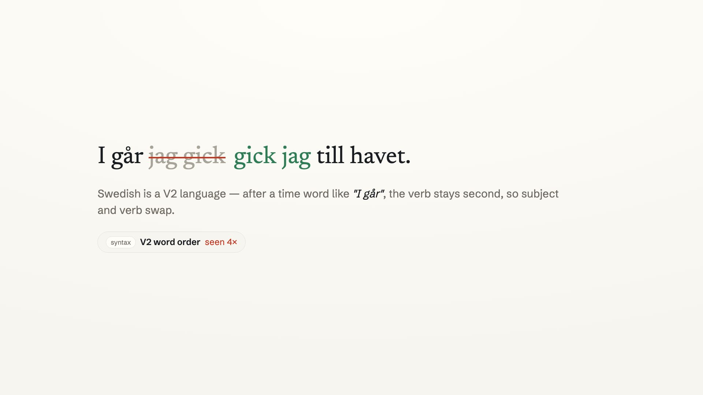
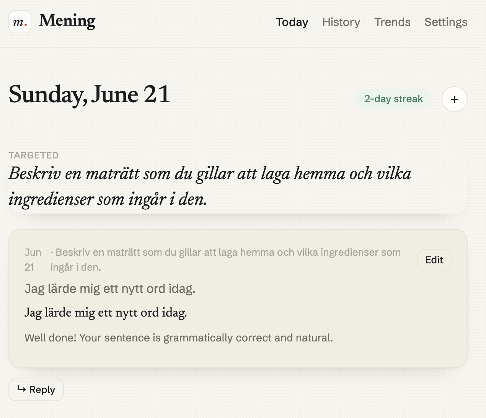
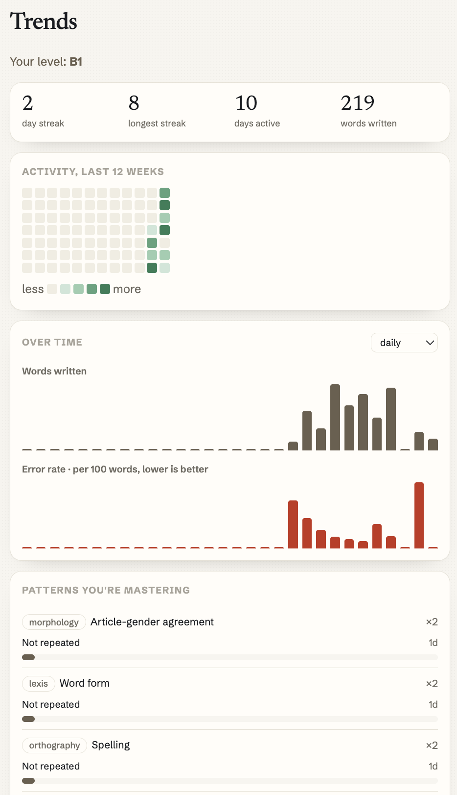
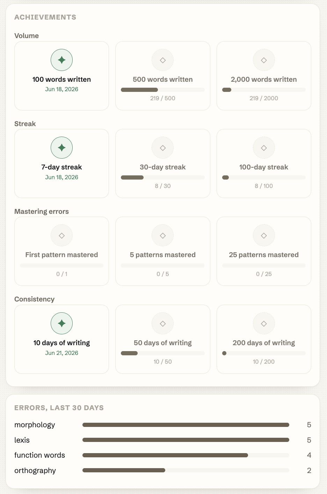

# Mening skill — daily language writing practice for your AI agent

> your users are starting to live inside an agent. if your app isn't a skill it can load, you don't exist to it. this is mening's.



Run real **language-learning writing practice** from your self-hosted agent
([OpenClaw](https://openclaw.ai) / [Hermes Agent](https://hermes-agent.nousresearch.com)).
One prompt a day in the language you're learning, a correction, and — the part that
matters — **memory of the mistakes you repeat**, so you see your real error patterns over
weeks, not a one-off fix.

One [`SKILL.md`](./SKILL.md) works on both platforms. It talks to your own
[Mening](https://mening.app) account over its API.

## What a real run looks like

```text
you:   what's my writing topic today?
agent: Beskriv en maträtt som du gillar att laga hemma och vilka ingredienser som ingår i den.
       (Describe a dish you like to cook at home and the ingredients in it.)

you:   what mistakes do I keep making?
agent: your recurring error patterns:
       - function_words · article_missing — 4×
       - morphology · word_form — 3×
       - lexis · word_choice — 3×
       - orthography · spelling — 2×
```

## Setup
1. Create a free account at https://mening.app?utm_source=github&utm_medium=readme&utm_campaign=mening-skill and pick the language you're learning.
2. Settings → **Developer / API access** → copy your API token.
3. `export MENING_API_TOKEN=<your token>` (optional `MENING_API_BASE`, default `https://mening.app/api/v1`). Requires `curl` and `jq`.
4. Drop this folder into `~/.openclaw/skills/mening/` (OpenClaw) or `~/.hermes/skills/mening/` (Hermes).

## Use it from chat
- "What's my writing topic today?"
- "Correct this: <a sentence in your target language>"
- "What mistakes do I keep making?"

## About Mening — the app behind the skill

[Mening](https://mening.app) is a **daily writing practice app for language learners**.
It's language-agnostic: practice Swedish, Spanish, German, French, Italian — any language
you're learning. Each day it sends one short prompt; you write a sentence or two in your
target language; an LLM **corrects your grammar** and explains what was off.

The difference from a flashcard app or a one-shot grammar checker is **longitudinal error
tracking**. Mening remembers the specific mistakes you repeat — missing articles, word
order, verb forms, gender agreement — turns each into a tracked **error pattern**, and aims
future prompts at your real weak spots. Correction is a commodity; the memory of your
recurring errors is the product. That's the same record this skill reads back to you inside
your agent.

- **Daily prompt → write → AI correction**, in any target language
- **Recurring-mistake memory** — your error patterns tracked over weeks, with a synthesized rule per pattern
- **Streaks, progress, targeted practice** that aims at your weakest patterns
- Works in [Telegram](https://t.me/MeningAppBot), web, and iOS — and now your AI agent
- Free 14-day trial, no card → **[mening.app](https://mening.app?utm_source=github&utm_medium=readme&utm_campaign=mening-skill)**

## Inside Mening

The daily loop, your progress, and the recurring-mistake memory the skill reads back:

| Today | Trends | Progress |
|---|---|---|
|  |  |  |

## What it does NOT do
Your token grants full access to your Mening account — treat it like a password. The skill
only reads your prompts/history and submits sentences you write.

## Why this exists
Built to make Mening reachable from the agent platforms people now run their day through.
The full story: https://lihachev.pro/posts/agent-or-invisible/

MIT licensed. Issues and PRs welcome.
